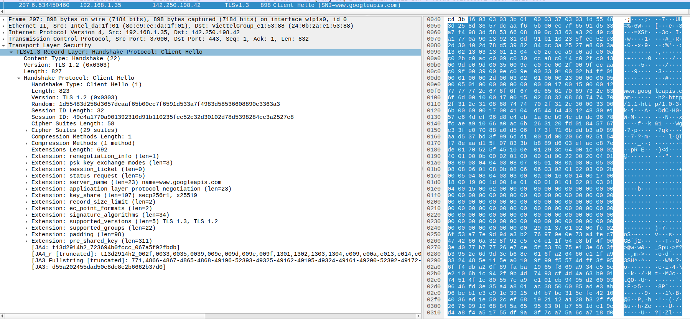
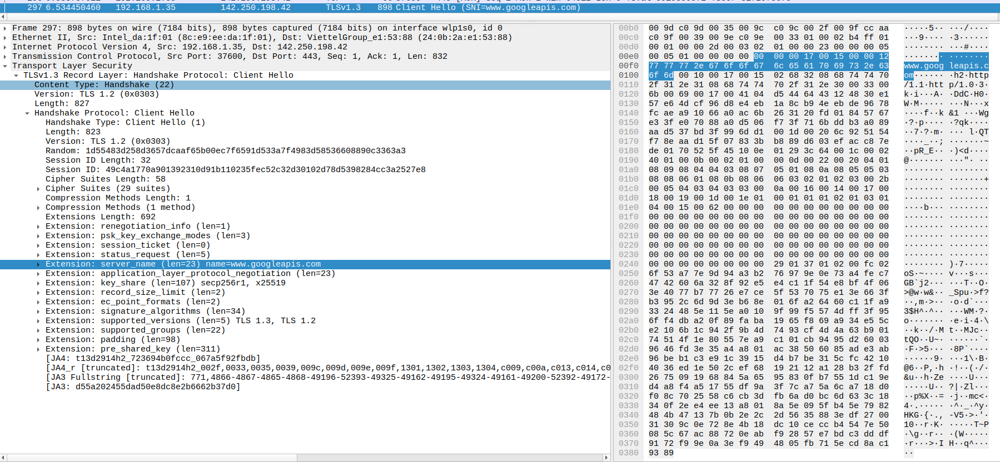

# TLS ClientHello SNI payload walkthrough

Tài liệu này giải thích packet TLS ClientHello được capture trong Wireshark,
cách xác định TCP/TLS payload, và cách `extract_tls_sni()` parse SNI từ payload đó.

Ảnh minh họa:

TLS payload trong Wireshark:



SNI extension trong Wireshark:



## Packet tổng quan

Packet trong ảnh là frame 297:

```text
Frame: 898 bytes
IPv4: 192.168.1.35 -> 142.250.198.42
TCP: 37600 -> 443, Len: 832
TLS: Client Hello, SNI=www.googleapis.com
```

Với packet này, kích thước các lớp là:

```text
Ethernet header  = 14 bytes
IPv4 header      = 20 bytes
TCP header       = 32 bytes
TCP/TLS payload  = 832 bytes
Total frame      = 14 + 20 + 32 + 832 = 898 bytes
```

Vì vậy TLS payload bắt đầu tại offset:

```text
14 + 20 + 32 = 66 bytes = 0x42
```

Trong hex view của Wireshark, quanh offset `0x40` có:

```text
... c4 3b 16 03 03 03 3b 01 00 03 37 ...
         ^^ TLS payload bắt đầu tại byte 0x16
```

Hai byte `c4 3b` trước đó vẫn thuộc TCP header. TLS payload thực sự bắt đầu từ:

```text
16 03 03 03 3b ...
```

## Payload trong code là gì?

Trong project này, `payload` truyền vào `extract_tls_sni()` là TCP payload,
không phải full Ethernet frame.

Luồng xử lý:

```text
parse_packet()
-> parse_ipv4() / parse_ipv6()
-> parse_tcp()
-> extract_tls_sni(out.payload, out.payload_len, ...)
```

Trong `parse_tcp()`:

```c
out->payload = packet + tcp_off + tcp_hlen;
out->payload_len = packet_len - tcp_off - tcp_hlen;
```

Với packet trong ảnh:

```text
packet_len   = IPv4 total length = 884
tcp_off      = IPv4 header length = 20
tcp_hlen     = TCP header length = 32
payload_len  = 884 - 20 - 32 = 832
```

Giá trị `832` này khớp với Wireshark:

```text
Transmission Control Protocol, Len: 832
```

## Cấu trúc TLS payload

TLS payload của packet này dài `832` byte và bắt đầu bằng TLS record header:

```text
16 03 03 03 3b
```

Map theo field:

| Payload offset | Size | Bytes | Ý nghĩa |
| --- | ---: | --- | --- |
| `0` | 1 | `16` | TLS content type = `22`, tức Handshake |
| `1` | 2 | `03 03` | TLS record version = `0x0303` |
| `3` | 2 | `03 3b` | TLS record body length = `827` |
| `5` | 1 | `01` | Handshake type = `1`, tức ClientHello |
| `6` | 3 | `00 03 37` | ClientHello body length = `823` |

TLS record header dài 5 byte, nên tổng TLS record là:

```text
5 + 827 = 832 bytes
```

ClientHello handshake header dài 4 byte, nên:

```text
4 + 823 = 827 bytes
```

Hai phép tính này giải thích vì sao `payload_len` bằng đúng `832`.

## ClientHello body

Sau TLS record header và handshake header, ClientHello body có dạng:

```text
[legacy_version 2]
[random 32]
[session_id_len 1][session_id...]
[cipher_suites_len 2][cipher_suites...]
[compression_methods_len 1][compression_methods...]
[extensions_len 2][extensions...]
```

Với packet này:

| Payload offset | Field | Giá trị |
| ---: | --- | --- |
| `9` | ClientHello legacy_version | `0x0303` |
| `11` | random | 32 bytes |
| `43` | session_id_len | 32 |
| `44` | session_id | 32 bytes |
| `76` | cipher_suites_len | 58 |
| `78` | cipher_suites | 58 bytes |
| `136` | compression_methods_len | 1 |
| `137` | compression_methods | `00` |
| `138` | extensions_len | 692 |
| `140` | extensions start | bắt đầu danh sách extensions |

`extract_tls_sni()` không cần các field như random, session id, cipher suites,
compression methods, nên code chỉ đọc length rồi skip qua chúng để tới extensions.

## Cách parse SNI extension

TLS extension có format chung:

```text
[ext_type 2][ext_len 2][ext_data...]
```

SNI là extension type `0`, còn gọi là `server_name`.

Trong packet này, extension SNI nằm tại payload offset `165`:

```text
00 00 00 17 00 15 00 00 12 77 77 77 2e 67 6f 6f 67 6c 65 61 70 69 73 2e 63 6f 6d
```

Map chi tiết:

| Payload offset | Size | Bytes | Ý nghĩa |
| ---: | ---: | --- | --- |
| `165` | 2 | `00 00` | `ext_type = 0`, server_name/SNI |
| `167` | 2 | `00 17` | `ext_len = 23` |
| `169` | 2 | `00 15` | `server_name_list_len = 21` |
| `171` | 1 | `00` | `name_type = 0`, host_name |
| `172` | 2 | `00 12` | `name_len = 18` |
| `174` | 18 | `77 77 77 ...` | hostname bytes |

Hostname bytes ở offset `174` decode ASCII thành:

```text
www.googleapis.com
```

Đây là lý do Wireshark hiển thị:

```text
Client Hello (SNI=www.googleapis.com)
```

## Map vào `extract_tls_sni()`

Các bước chính trong `src/tls_sni_parser.c`:

```text
1. Đọc TLS record header:
   content_type, record_version, record_len

2. Kiểm tra content_type == 22:
   chỉ xử lý TLS Handshake record

3. Đọc handshake header:
   handshake_type, handshake_len

4. Kiểm tra handshake_type == 1:
   chỉ xử lý ClientHello

5. Skip các field không cần cho SNI:
   version, random, session_id, cipher_suites, compression_methods

6. Đọc extensions_len rồi duyệt từng extension:
   [ext_type][ext_len][ext_data]

7. Khi ext_type == 0:
   parse server_name_list, tìm name_type == 0, copy hostname
```

Trong unit test, payload này được dùng tại:

```text
tests/test_parsers.c
test_tls_sni_captured_googleapis()
```

Chạy test:

```sh
make test
```

Kết quả mong đợi:

```text
parser tests passed
```

## Lưu ý khi tự copy payload từ Wireshark

Payload đưa vào `extract_tls_sni()` phải là TCP payload, bắt đầu bằng TLS record:

```text
16 03 03 ...
```

Không copy full Ethernet frame. Nếu copy full frame, bytes đầu sẽ là MAC address,
ví dụ `24 0b 2a ...`, và parser sẽ fail vì byte đầu không phải TLS content type
`0x16`.

Parser hiện tại cũng chỉ xử lý trường hợp TLS ClientHello nằm đủ trong một TCP
segment. Nếu TLS record bị chia qua nhiều TCP segment, cần TCP reassembly trước
khi gọi `extract_tls_sni()`.

Ngoài ra, SNI chỉ đọc được khi ClientHello chứa plaintext SNI. Với Encrypted
ClientHello, hostname có thể không còn thấy được trong payload.
